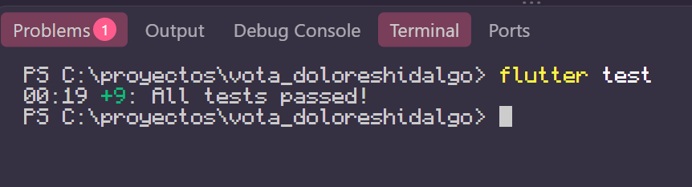
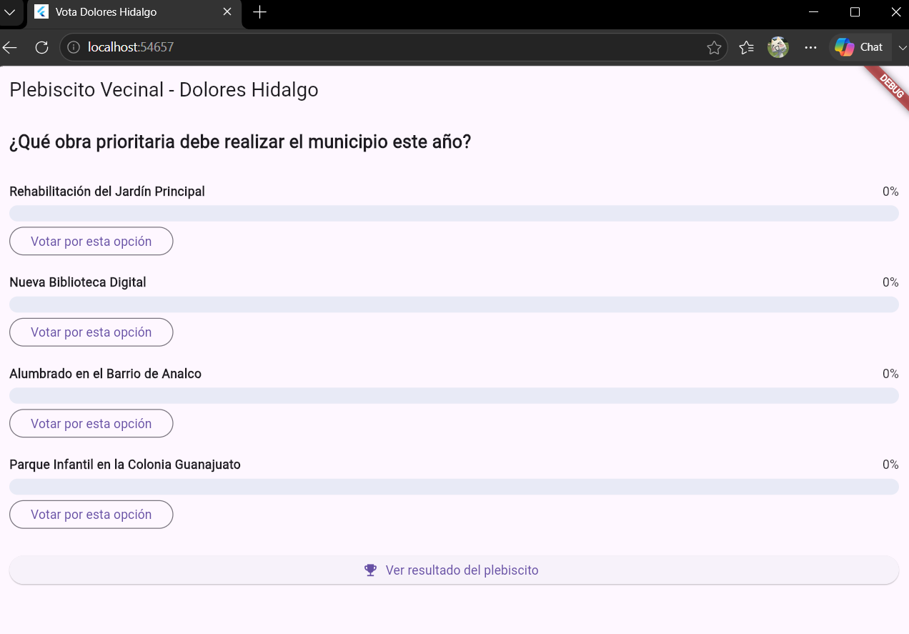
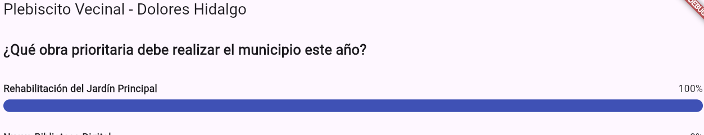
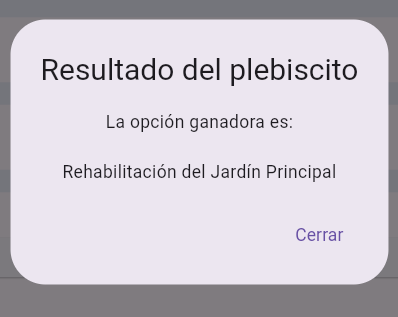

# Vota Dolores Hidalgo - Plebiscito Vecinal con TDD

Proyecto desarrollado con la metodología TDD (Test-Driven Development) en Flutter.

## Evidencia de Pruebas (TDD)
Todas las pruebas unitarias e integrales pasaron exitosamente:

## Evidencia de la Aplicación en Funcionamiento

| Pantalla Principal | Voto y Barras Animadas | Ganador |
| :---: | :---: | :---: |
|  |  |  |
